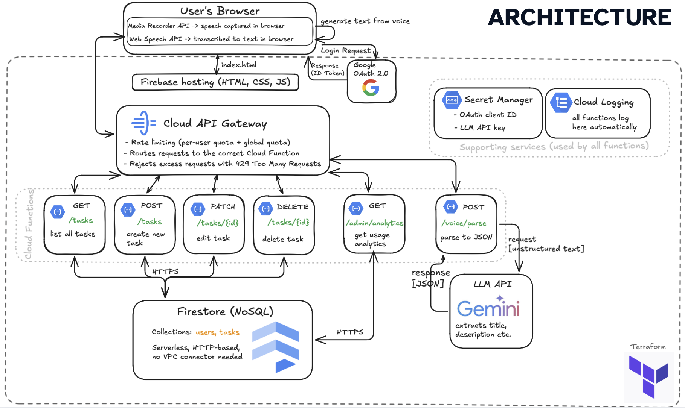

# Task Manager

A serverless task management web app on Google Cloud Platform. Users sign in with Google OAuth, create and edit tasks, filter by status and priority, add tasks by voice (powered by Gemini), and view analytics (admin only). <br>
[Demo Link](https://project-f030ec6e-8d7b-4d6a-9e3.web.app/)

## Architecture



**Request flow:**

1. The browser loads static assets from **Firebase Hosting**.
2. The user signs in via **Google OAuth 2.0** and receives a JWT (ID Token).
3. The frontend sends API requests to **Cloud API Gateway**.
4. The gateway routes requests to the appropriate **Cloud Functions** and enforces quotas.
5. Functions verify the token, read/write data in **Firestore**, and call the **Gemini API** when needed.
6. Secrets (`LLM_API_KEY`, `GOOGLE_CLIENT_ID`) live in **Secret Manager** and are only available to the backend.
7. Errors are logged to **Cloud Logging** without exposing secrets to the client.

## Main Features

| Feature | Description |
|---------|-------------|
| **Google Sign-In** | Login via Google Identity Services, session backed by JWT |
| **Task CRUD** | Create, view, edit, and delete tasks |
| **Filtering** | By status (`todo`, `in_progress`, `done`) and priority (`low`, `medium`, `high`) |
| **Calendar** | Tasks with due dates shown on a calendar view |
| **Voice input** | Browser audio recording → Gemini extracts `title`, `description`, `priority`, `due_date` |
| **Admin analytics** | Summary of users and tasks (admin role only) |
| **Rate limiting** | 60 requests per minute per user via API Gateway |

## API Endpoints

| Method | Path | Cloud Function |
|--------|------|----------------|
| `GET` | `/tasks` | `list_tasks` |
| `POST` | `/tasks` | `create_task` |
| `GET` | `/tasks/{id}` | `get_task` |
| `PATCH` | `/tasks/{id}` | `update_task` |
| `DELETE` | `/tasks/{id}` | `delete_task` |
| `POST` | `/voice/parse` | `voice_parse` |
| `GET` | `/admin/analytics` | `admin_analytics` |

## Project Structure

```
task-manager/
├── architecture.png          # Architecture diagram
├── frontend/                 # SPA (Firebase Hosting)
│   ├── index.html
│   ├── css/styles.css
│   └── js/
│       ├── config.js         # GOOGLE_CLIENT_ID, API_BASE_URL
│       ├── auth.js           # Google Sign-In
│       ├── api.js            # HTTP client for API Gateway
│       ├── tasks.js          # Tasks, calendar, voice
│       ├── admin.js          # Admin analytics
│       ├── app.js            # Entry point
│       └── ui.js             # UI helpers
├── backend/
│   ├── common/
│   │   └── safe_errors.py    # Safe logging (no secret leakage)
│   ├── list_tasks/           # GET /tasks
│   ├── get_task/             # GET /tasks/{id}
│   ├── create_task/          # POST /tasks
│   ├── update_task/          # PATCH /tasks/{id}
│   ├── delete_task/          # DELETE /tasks/{id}
│   ├── voice_parse/          # POST /voice/parse (Gemini)
│   └── admin_analytics/      # GET /admin/analytics
├── terraform/                # GCP infrastructure (see below)
├── firebase.json             # Firebase Hosting config
└── .firebaserc
```

## Terraform — File Reference

All infrastructure is defined in `terraform/`. Each file covers a specific area:

### `main.tf`
Terraform setup: `google` and `google-beta` providers, bound to the project and region from `variables.tf`.

### `variables.tf`
Input variables:
- `project_id` — GCP project ID
- `region` — region for Functions, Firestore, Storage (`europe-central2`)
- `api_gateway_region` — API Gateway region (`europe-west1`, since `europe-central2` is not supported)

### `data.tf`
`google_project` data source — fetches project metadata (project number for IAM service accounts).

### `apis.tf`
Enables required Google Cloud APIs: API Gateway, Cloud Functions, Cloud Build, Firestore, Secret Manager, Cloud Storage, Cloud Run, Artifact Registry, and others.

### `firestore.tf`
- Creates a Firestore database (Native mode) in `var.region`
- Composite indexes on the `tasks` collection (`user_id` + `status` + `priority`)

### `storage.tf`
GCS bucket `{project_id}-functions-source` — stores Cloud Function source zip archives before deployment.

### `secrets.tf`
- Secret Manager: `llm-api-key` (Gemini key) and `google-oauth-client-id`
- IAM: grants the `task-manager-sa` service account read access to both secrets

### `iam.tf`
Access permissions:
- `task-manager-sa` — Firestore (`datastore.user`) and Secret Manager (`secretAccessor`)
- Cloud Build and Compute service accounts — build, deploy Cloud Functions Gen2, access bucket and Artifact Registry
- Impersonation: Build/Compute can act as `task-manager-sa`

### `functions.tf`
Backend core:
- 7 Cloud Functions Gen2 (Python 3.12)
- Builds zip archives (main.py + requirements.txt + `safe_errors.py`) and uploads to GCS
- Deploys functions with secrets from Secret Manager
- IAM: API Gateway can invoke each function (`cloudfunctions.invoker`)

### `api_gateway.tf`
- Creates the API, API Config, and Gateway
- Injects function URLs into the OpenAPI spec from `openapi.yaml.tpl`
- Publishes a public HTTPS endpoint

### `openapi.yaml.tpl`
OpenAPI 2.0 template for API Gateway:
- Routes `/tasks`, `/tasks/{taskId}`, `/voice/parse`, `/admin/analytics`
- CORS preflight (`OPTIONS`)
- Quota: 60 requests/min per user (`x-google-quota`)

### `outputs.tf`
Output values after `terraform apply`:
- `api_gateway_url` — URL for `frontend/js/config.js`
- `function_uris` — direct function URLs (for debugging)
- `functions_service_account` — functions service account email

## Deployment

### 1. Secrets in Secret Manager

Before the first deploy,  secret values were added:

```bash
echo -n "YOUR_GEMINI_API_KEY" | gcloud secrets versions add llm-api-key --data-file=-
echo -n "YOUR_GOOGLE_CLIENT_ID" | gcloud secrets versions add google-oauth-client-id --data-file=-
```

### 2. Infrastructure (Terraform)

```bash
cd terraform
terraform init
terraform apply
```

After apply, `api_gateway_url` was copied into `frontend/js/config.js` → `API_BASE_URL`.

### 3. Frontend (Firebase Hosting)

```bash
firebase deploy --only hosting
```

### 4. Viewing Logs

```bash
gcloud logging read \
  'resource.labels.service_name="voice-parse" AND severity>=ERROR' \
  --project=YOUR_PROJECT_ID \
  --limit=20
```

## Tech Stack

| Layer | Stack |
|-------|-------|
| Frontend | HTML, CSS, Vanilla JS, Firebase Hosting |
| Backend | Python 3.12, Cloud Functions Gen2, functions-framework |
| Database | Firestore |
| AI | Google Gemini (`gemini-2.5-flash-lite`) |
| Auth | Google OAuth 2.0 (ID Token) |
| IaC | Terraform |
| API | Cloud API Gateway (OpenAPI 2.0) |

## SLA, SLO, SLI

### Core Task API

#### SLA

The Task Manager API will be available at least **99%** of the time per calendar month, excluding scheduled maintenance.

If monthly availability falls below 99%, affected users will receive **one Ferrero Rocher chocolate** as compensation.

#### SLO

| SLO | Target | Measurement Window |
|-----|--------|-------------------|
| Availability | at least 99.5% requests succeed | per calendar month |
| p95 Latency | 95% of requests respond in less than 2 seconds | per calendar month |

#### SLI

| SLI | Metric | How to collect |
|-----|--------|----------------|
| Availability | % of HTTP requests returning successful responses | Cloud Monitoring — Cloud Functions request count, filter by response code |
| Latency | response time of requests | Cloud Monitoring — Cloud Functions latency distribution |

---

### Voice Assistant

#### SLA

The voice assistant will successfully return task fields within **2 minutes** for at least **95%** of requests per calendar month.

If the monthly p95 latency target is missed, affected users will receive **two Ferrero Rocher chocolates** as compensation.

#### SLO

| SLO | Target | Measurement Window |
|-----|--------|-------------------|
| Availability | at least 99% of succeeded auto-filling requests | per calendar month |
| p95 End-to-End Latency | form auto-fill completes in less than 2 minutes for 95% of requests | per calendar month |

#### SLI

| SLI | Metric | How to collect |
|-----|--------|----------------|
| Availability | % of auto-filling requests returning successful responses | Cloud Monitoring — Cloud Functions request count |
| End-to-End Latency | time from transcript submission to auto-filled fields | Client-side timer logged to Cloud Logging |
